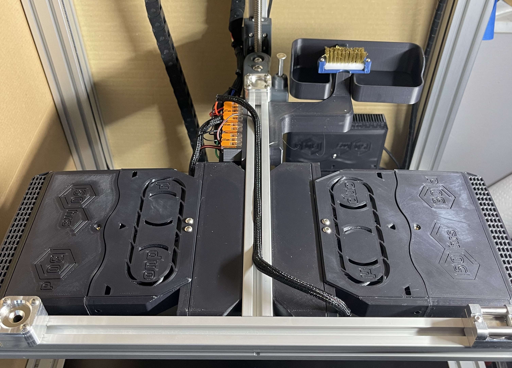

# Nevermore_Spacer_Mount

# If you're thinking about printing this, version 2 is coming in the next few days. The new version will require less filament to print and will have a universal mounting design that fits any Trident size.

Spacer made for mounting <a href="https://github.com/nevermore3d/Nevermore_Micro/tree/master/V5_Duo/Mods/Rear-Backmount-Plenum_by-mvieleers"> mvieleer's rear backmount nevermore plenum mod</a> to the Voron Trident's bed carriage.

Currently optimized for regular v5 Nevermore cartridges. Using XL Nevermore cartridges requires 10mm more clearance. Check spacing before using XL cartridges.

I have only printed the 300 version. The 250 and 350 versions are currently untested. Feedback on those parts is appreciated.

Based on the <a href="https://github.com/nevermore3d/Nevermore_Micro"> original Nevermore CAD.</a>

## BOM (per spacer)

M5x35 screws x2

M5 roll-in t-nut x2

M3x5x4 Heatset Inserts x2 

M3x8 screws x2

M3x25 screws x1

M3 roll-in t-nut x1

## Assembly

1. Use soldering iron to install M3 heat inserts.

2. Install M5 t-nuts into Trident carriage extrusion on Y axis.

3. Install M3 roll-in nut into Trident carriage extrusion on X axis.

4. Install Spacer using M5 screws.

5. Insert M3x25 screw into Nevermore plenum side mounting point.

6. Install Nevermore plenum onto spacer, but don't fully tighten M3x8 screws.

7. Partially thread M3x25 screw into roll-in nut. <a href="https://github.com/Outrider305/Nevermore_Spacer_Mount/blob/main/Images/nevermore_side_mount_screw.png"> See photo for example</a>

8. Check alignment of Nevermore with extrusion, and fully tighten M3 screws.

## Power

I powered my nevermores with a common 24V power straight from the PSU in order to reduce the number of wires added to the Z chain. I then ran a single signal cable from the MCU to a wago which triggers all four nevermores. I've included my bed wago mount in the repo.

Trident Power Wago STL:
- Top Row
	- 5 slot wago: 24V+ power from PSU
	- 2 slot wago: 24V- signal wire for under bed LED lights
	- 3 slot wago: 24V- signal wire for Nevermore Bed Fans
- Bottom Row
	- 2 slot wagos for Mains (L/N/G), thermal fuse, and bed thermistor

## Macro Control

<a href="https://github.com/VoronDesign/VoronUsers/tree/master/printer_mods/Ellis/Bed_Fans"> Ellis Bed Fans macros </a>

## Thanks

- Thanks to Chanders on the Voron Discord for feedback and picture of the spacer.

## Contact

Contact me via Discord, outrider305#4587, with any questions.
