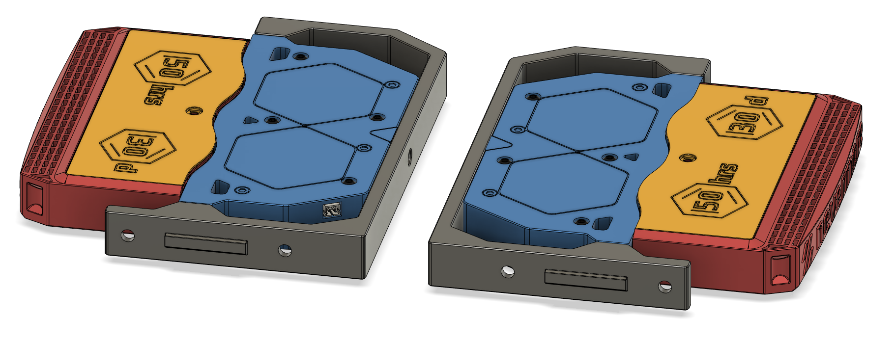
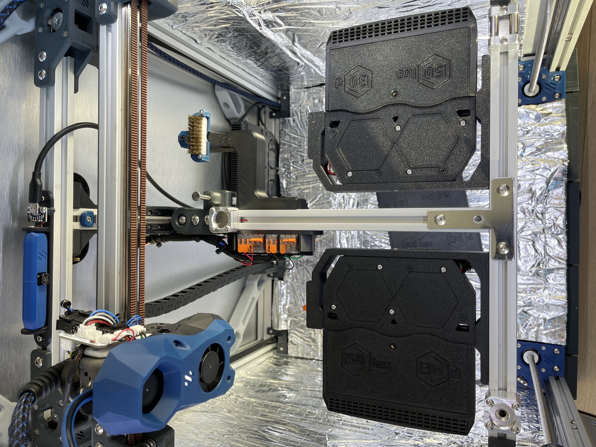
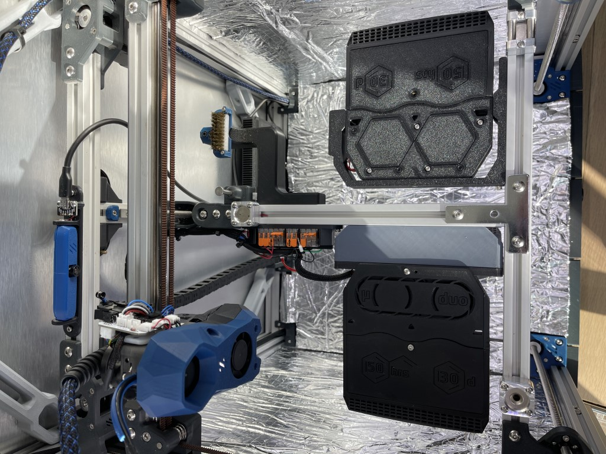
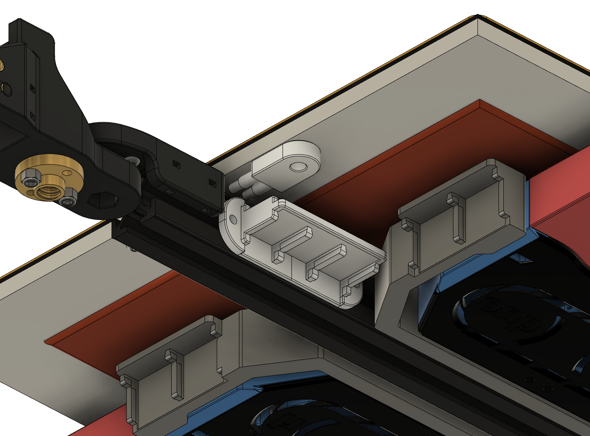

# Trident_Nevermore_Bed_Mount

# Testing Update: Nevermore Bed Fans installed. Minor updates planned for bracket to make installation easier.

Total redesign of my original Nevermore Spacer Mount for Voron Tridents. This version utilizes it's own modded V5 Duo plenum and cartridges with a third set of magnets. I found that any slight bump or the occasional z-hop with the original parts would cause a cartridge loaded with carbon to fall off the plenum. Hopefully the added magents will solve that problem.

## Version 1 and 2 Comparison

## New Version Features

Intake orientation for the Nevermore has been inverted to draw cooler air from below the bed. This will help extend the use life of the carbon,<a href="https://discord.com/channels/1017933489779245137/1018610421311225966/1036338929097523210"> per this post on the Nevermore Discord. </a>

There is also now one mounting bracket for all Trident sizes and will reduce filament usage for larger Trident owners. The bracket includes mounting points for 3-slot Wago 221s to power the nevermores. Details below on how I powered my nevermores. I've included a Wago mount for regular Trident bed power connections. I've also left my older large Wago mount with space for extra 24V mods.

## Change Log

- **11-28-2022**
	- Updated Plenum body STL. Removed chamfer on M3 holes for 5015 screws and replaced with crosshatch bridging.
	- CAD updated.
- **11-24-2022**
	- Updated brackets to use BOM standard M5x10 screws rather than M5x8.
	- Adjusted geometry of built-in support for cartridge heatset insert. Should be easier to remove with pliers.
	- CAD updated.
	
## Recommended Print Settings and Material

- Standard Voron part settings (4 walls, 5 top and bottom layers, 40% infill)
- ABS or ASA recommended for this mod. I haven't had good experience with eSun ABS+, so I can't guarantee the bracket won't sag if you use ABS+. Each manufacturer is different.

## BOM (per Nevermore)

- M5x10 screws x2

- M5 roll-in t-nut/hammerhead nut x2

- M3x5x4 (Standard Voron size) Heatset Inserts x3 

- M3x8 screws x1

- M3x12 screws x2

- M3x16 x4

- 3-slot Wago 221s x2

- 24 AWG wiring

## Assembly and Installation - WIP

** Removal of Trident bed is recommended for easier access.**

1. Install and wire 5015 fans in the plenum according to your preference. If using JST XH connectors, it must be connected before mounting the plenum on the bracket. There will not be enough space to run wiring or connect JST after mounting nevermore onto bracket.

2. Glue magnets in place on both plenum and cartridge bodies.

3. Insert two M3 heatset inserts on mounting bracket, one at the rear of plenum, and one in the cartridge. Print-in-place support under the cartridge heatset can be removed with pliers. 

4. Install 3-slot Wagos onto bracket (if you will use them).

5. Install M3x12 screws into side mounting points on Nevermore Plenum. Keep loose until final fitting.

5. Mount bracket onto Trident bed extrusion with M5 screws, but don't fully tighten them. You will need to adjust bracket position according to your bed size and cartridge size.

6. Once you have found your chosen bracket position, tighten M5 screws. Plenum body will be able to [swing away](Images/Install_procedure.JPEG) for access to M5 screws.

7. Run additional 24V+ and 24V- wires through the Z chain to the Nevermore wagos. Details below.

## Power

I wired my nevermores in parallel with +24V power straight from the PSU to the bed wago and a single -24V signal wire from the MCU to a wago which controls both Nevermores. This method reduces the amount of added wires to the Trident bed chain.

Trident_Bed_Wago_Large:
- Top Row
	- 5 slot wago: 24V+ power from PSU
	- 2 slot wago: 24V- signal wire for any other 24V mod.
	- 3 slot wago: 24V- signal wire for Nevermore Bed Fans
- Bottom Row
	- 2 slot wagos for Mains (L/N/G), thermal fuse, and bed thermistor
	
Trident_Bed_Wago_Small:
- Mains L/N/G
- Thermal Fuse
- Bed Thermistor

## Macro Control

<a href="https://github.com/VoronDesign/VoronUsers/tree/master/printer_mods/Ellis/Bed_Fans"> Ellis Bed Fans macros </a>

## Credits

- Thanks to 0ndsk4 and eduncan911 for advice and supporting mods to the Nevermore Micro.
- Inspired by <a href="https://github.com/nevermore3d/Nevermore_Micro/tree/master/V5_Duo/Mods/Rear-Backmount-Plenum_by-mvieleers"> mvieleer's rear backmount nevermore plenum mod.</a>
- Created using original <a href="https://github.com/nevermore3d/Nevermore_Micro"> Nevermore Micro V5 Duo CAD.
- Trident CAD parts imported from the <a href="https://github.com/VoronDesign/Voron-Trident"> official Voron github.</a>

## Contact

Contact me via Discord, outrider305#4587.
