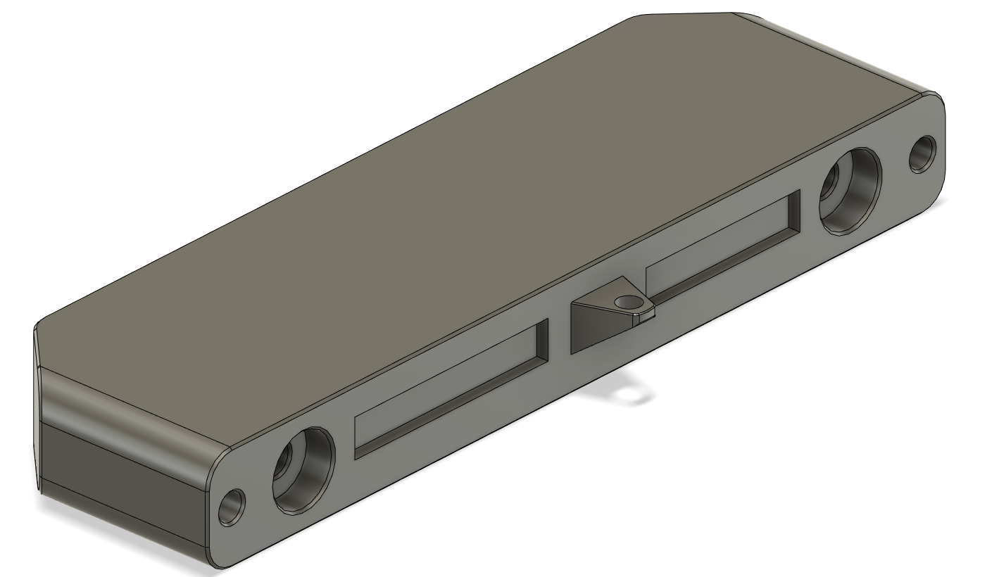
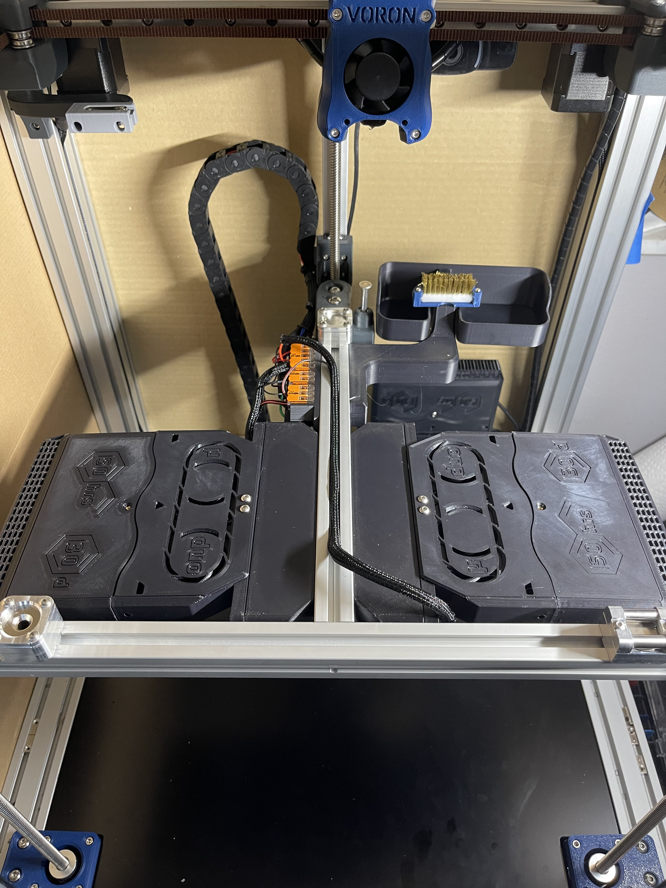

# Nevermore_Spacer_Mount
Spacer made for mounting mvieleer's modded v5 duo nevermore plenum to the Voron Trident's bed carriage.

Currently optimized for 300 Trident carriages and regular v5 Nevermore cartridges. Using XL Nevermore cartridges will need 10mm more clearance. Contact me if you need 250 or 350 Trident versions.

Based on and created from the original Nevermore CAD located at: https://github.com/nevermore3d/Nevermore_Micro.

## BOM (per spacer)

M5x35 screws x2

M5 roll-in t-nut x2

M3x5x4 Heatset Inserts x2 

M3x8 screws x2

M3x25 screws x1

M3 roll-in t-nut x1

## Assembly

1. Use soldering iron to install M3 heat inserts.

2. Install M5 t-nuts into Trident carriage extrusion on Y axis.

3. Install M3 roll-in nut into Trident carriage extrusion on X axis.

4. Install Spacer using M5 screws.

5. Insert M3x25 screw into Nevermore plenum side mounting point.

6. Install Nevermore plenum onto spacer, but don't fully tighten M3x8 screws.

7. Partially thread M3x25 screw into roll-in nut. (See https://github.com/Outrider305/Nevermore_Spacer_Mount/blob/main/Images/nevermore_side_mount_screw.png)

8. Check alignment of Nevermore with extrusion, and fully tighten M3 screws.

## Power

I powered my nevermores with a common 24V power straight from the PSU in order to reduce the number of wires added to the Z chain. I then ran a single signal cable from the MCU to a wago which triggers all four nevermores. I've included my bed wago mount in the repo.

## Macro Control

See my other repo for macros: https://github.com/Outrider305/Doom_Trident_300_klipper_config_backup

## Special Thanks

- Thanks to 0ndsk4 for creating the Nevermore and Mvieleer for sharing his modded plenum.
- Thanks to Chanders on the Voron Discord for feedback and picture of the spacer.

## Contact

Contact me via Discord, outrider305#4587, with any questions.
