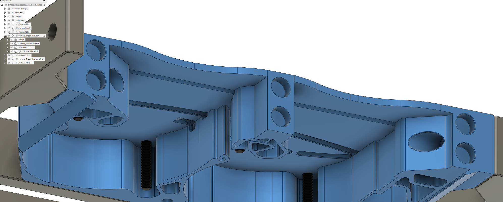

# Trident_Nevermore_Bed_Fans

# WIP - Undergoing initial test prints. STLs to be uploaded later today.

Total redesign of my original Nevermore Spacer Mount for Voron Tridents. This version utilizes it's own modded V5 Duo plenum and cartridges with a third set of magnets. I found that any slight bump or the occasional z-hop with the original parts would cause a cartridge loaded with carbon to fall off the plenum. Hopefully the added magents will solve that problem.

There is also now one mounting bracket for all Trident sizes and will reduce filament usage for larger Trident owners. The bracket includes mounting points for 3-slot Wago 221s to power the nevermores. Details below on how I powered my nevermores. I've included a Wago mount for regular Trident bed power connections. I've also left my older large Wago mount with space for extra 24V mods.

Intake orientation for the Nevermore has been inverted to draw cooler air from below the bed. This will help extend the use life of the carbon,<a href="https://discord.com/channels/1017933489779245137/1018610421311225966/1036338929097523210"> per this post on the Nevermore Discord. </a>

## BOM (per each Nevermore)

M5x8 screws x2

M5 roll-in t-nut x2

M3x5x4 Heatset Inserts x3 

M3x8 screws x3

3-slot Wago 221s x2

## Assembly

WIP

## Power

I wired my nevermores in parallel with a common +24V power source from the PSU to a wago. A single -24V signal wire can then be run from the MCU to a wago to control both Nevermores. This method reduces the amount of added wires to the Trident bed chain.

Trident Power Wago STL:
- Top Row
	- 5 slot wago: 24V+ power from PSU
	- 2 slot wago: 24V- signal wire for any other 24V mod.
	- 3 slot wago: 24V- signal wire for Nevermore Bed Fans
- Bottom Row
	- 2 slot wagos for Mains (L/N/G), thermal fuse, and bed thermistor

## Macro Control

<a href="https://github.com/VoronDesign/VoronUsers/tree/master/printer_mods/Ellis/Bed_Fans"> Ellis Bed Fans macros </a>

## Credits

- Thanks to 0ndsk4 and eduncan911 for advice and supporting mods to the Nevermore Micro.
- Inspired by <a href="https://github.com/nevermore3d/Nevermore_Micro/tree/master/V5_Duo/Mods/Rear-Backmount-Plenum_by-mvieleers"> mvieleer's rear backmount nevermore plenum mod.</a>
- Created using original <a href="https://github.com/nevermore3d/Nevermore_Micro"> Nevermore Micro V5 Duo CAD.
- Trident CAD parts imported from the <a href="https://github.com/VoronDesign/Voron-Trident"> official Voron github.</a>

## Contact

Contact me via Discord, outrider305#4587, with any questions.
